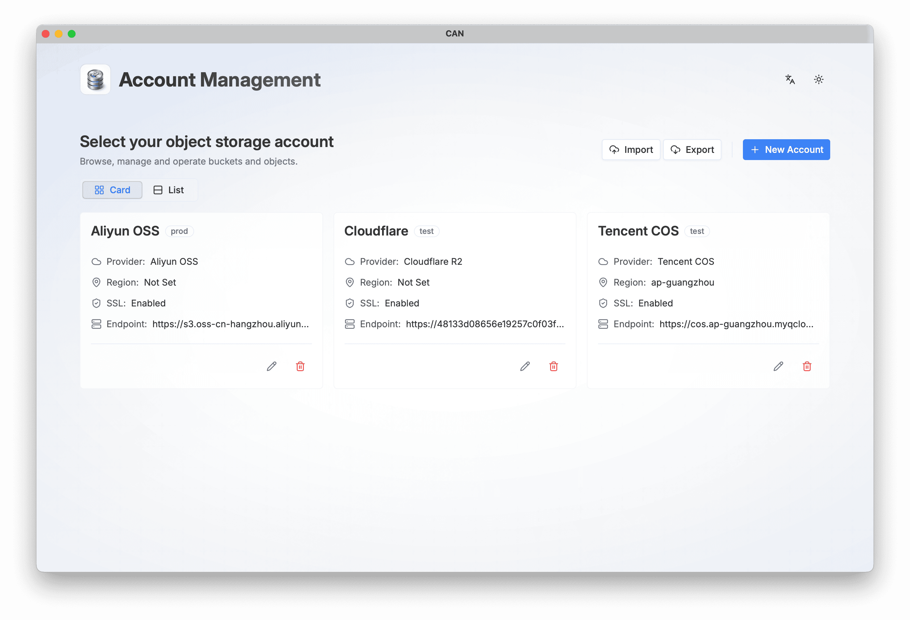
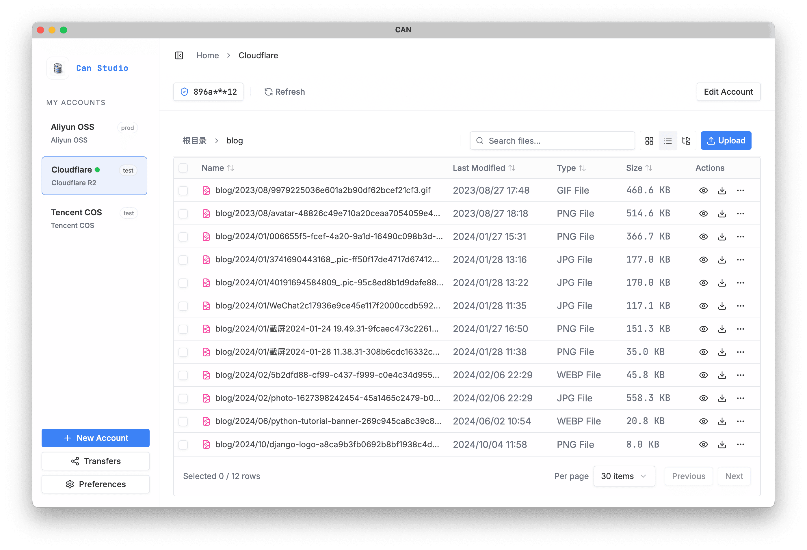
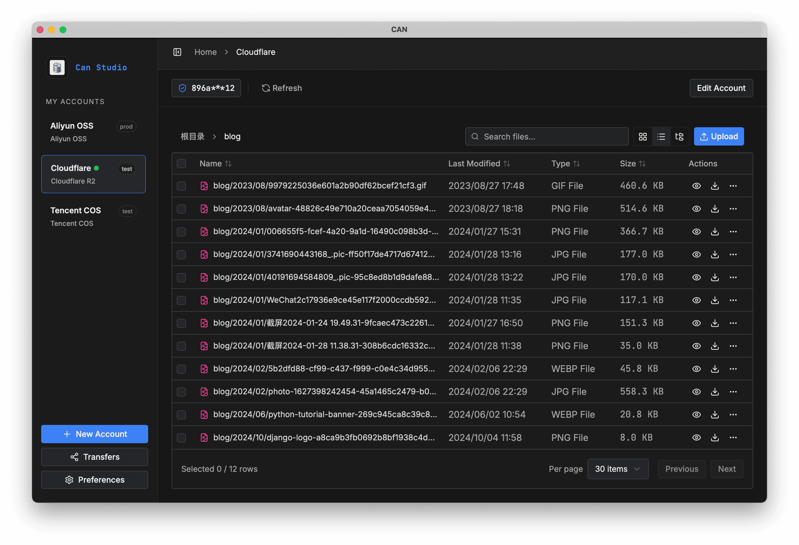
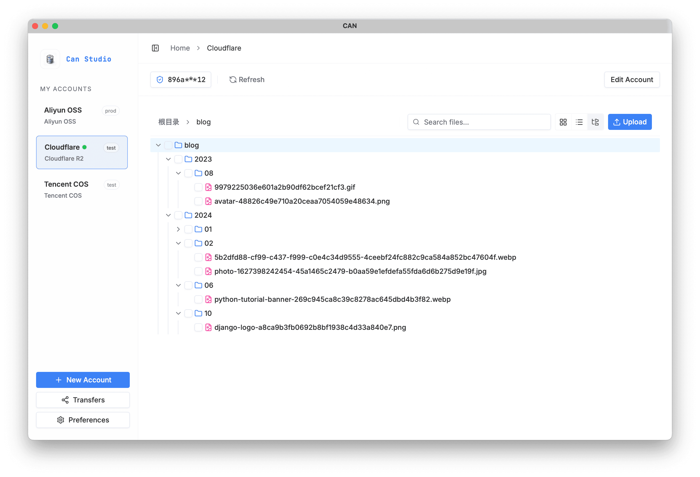
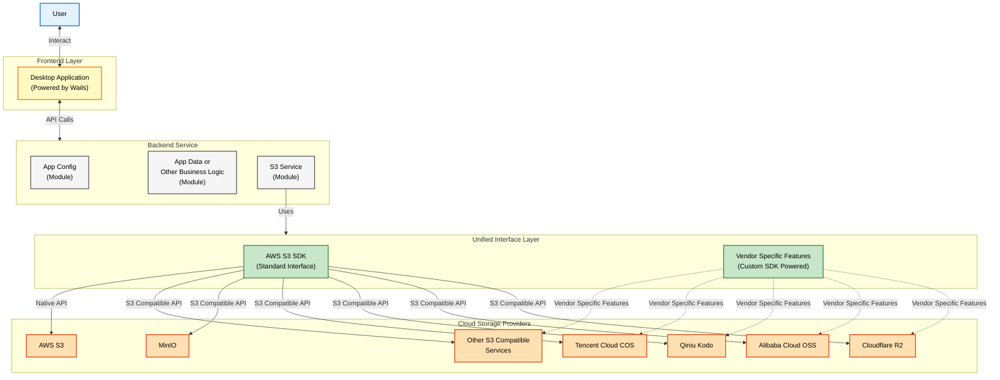

> [!WARNING]
> **Development Status**: This project is currently in **MVP/Beta**. It is still improving compatibility and vendor-specific support. Feedback and bug reports and PRs are very welcome!

<div align="center">


# Can

**Can** is a modern cross-platform desktop client for S3-compatible object storage.  
Built with Wails and React, it offers a sleek and consistent user experience across multiple cloud providers.


English | [简体中文](README_ZH.md)

<br />



<details>
<summary>📸 <strong>More Screenshots (List View, Dark Mode, Tree View)</strong></summary>
<br />
<div align="center">
  
  
  
</div>
</details>

</div>


## Features

- **Multi-Vendor Support**: Works with AWS S3, Aliyun OSS, Tencent COS, Cloudflare R2, and other S3-compatible services.
- **Sleek UI**: A modern, clean interface for browsing and managing objects.
- **Fully Local**: No intermediate servers involved. Your data and configurations are stored in a local SQLite database.
- **Consistent UX**: Enjoy the same experience on macOS, Windows, and Linux.
- **Simple Setup**: No complex configuration required—just connect and start managing.

## Tech Stack

- **Backend**: Go + Wails
- **Frontend**: React + TypeScript + Vite + Tailwind CSS + shadcn/ui + TanStack
- **Storage**: SQLite

## Architecture



## Contribution

### Prerequisites

- **Go**: Version 1.24 or higher.
- **Node.js**: Version 22 or higher.
- **pnpm**: Recommended package manager for frontend dependencies.

Please read [CONTRIBUTING.md](CONTRIBUTING.md) for more details on how to contribute.

### Development

1.  **Clone the repository**
    ```bash
    git clone https://github.com/100gle/can.git
    cd can
    ```

2.  **Let wails setup everything for you**
    ```bash
    wails dev
    ```
    the wails command will include the following steps:
    - install dependencies
    - build the application
    - run the application
    
   The application will be running in development mode with hot reloading.

3. **Some tools for development**
  - Run backend tests: `go test ./...`
  - Run frontend code quality:
    - lint: `pnpm --dir frontend lint`
    - format: `pnpm --dir frontend format`

## License

Distributed under the Apache License 2.0. See `LICENSE` for more information.