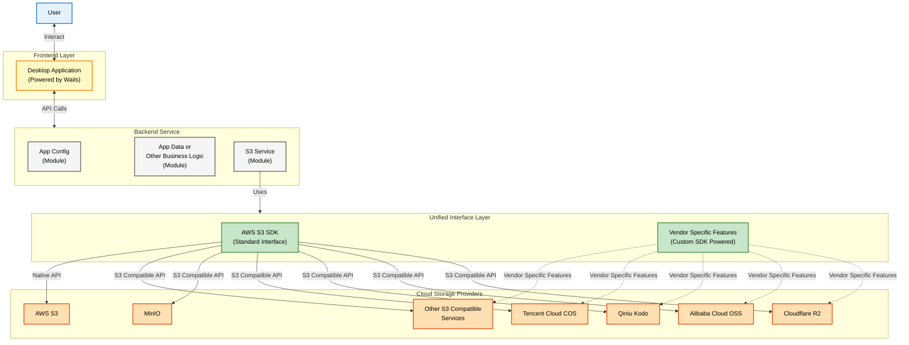

# Can

**Can** is a modern, cross-platform desktop client for managing S3-compatible object storage services. Built with Wails and React, it offers a high-performance, native-like experience for managing your files across multiple cloud providers.

## Features

- **Wide Vendor Support**: Fully supports major providers (AWS S3, Aliyun OSS, Tencent COS, Qiniu Kodo, Cloudflare R2, MinIO) via S3 API and native SDK integrations.
- **Modern UI**: A sleek, responsive interface allowing you to browse and manage objects just like your desktop file system.
- **Cross-Platform**: Seamlessly runs on macOS, Windows, and Linux.
- **Native Experience**: Interact with your cloud storage as if it were a local drive.
- **Local & Secure**: A purely local application—no intermediate servers. All your data and configurations are stored swiftly and securely on your client.
- **Out of the Box**: Zero complex configuration required. Uses a single local database file for easy management.

## Tech Stack

- **Backend**: [Go](https://go.dev/) + [Wails](https://wails.io/)
- **Frontend**: [React](https://react.dev/), [TypeScript](https://www.typescriptlang.org/), [Vite](https://vitejs.dev/)
- **UI Framework**: [TailwindCSS](https://tailwindcss.com/) + [shadcn/ui](https://ui.shadcn.com/)
- **Storage**: SQLite

## Architecture



## Contribution

### Prerequisites

- **Go**: Version 1.21 or higher.
- **Node.js**: Version 18 or higher.
- **pnpm**: Recommended package manager.

### Installation

1.  **Clone the repository**
    ```bash
    git clone https://github.com/yourusername/can.git
    cd can
    ```

2.  **Install dependencies and build**
    ```bash
    # Install frontend dependencies
    pnpm install

    # Build the application
    wails build
    ```
    The executable will be generated in the `build/bin` directory.

### Development

To run the application in development mode with hot reloading:

```bash
wails dev
```

This command will start both the Go backend and the Vite frontend dev server.

- **Frontend Only**: `pnpm --dir frontend dev` (for UI-only development)
- **Run Tests**: `go test ./...`
- **Frontend Code Quality**:
    - Lint: `pnpm --dir frontend lint`
    - Format: `pnpm --dir frontend format`

## License

Distributed under the Apache License 2.0. See `LICENSE` for more information.