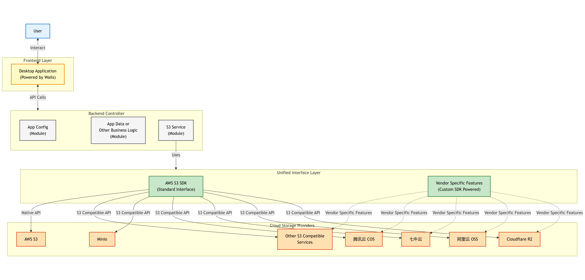
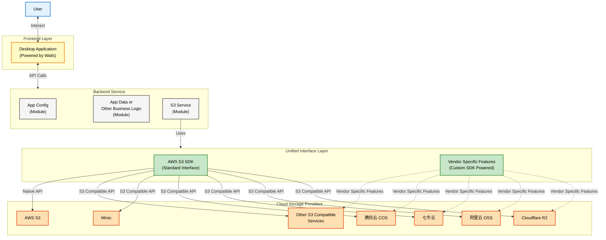

# CAN · S3 兼容对象存储工具

跨平台的 Wails + React 客户端，用于管理多账户的 S3 兼容对象存储（AWS、阿里云 OSS、腾讯云 COS、Cloudflare R2 等）。

## 开发与调试

- `wails dev`：同时热重载 Go + Vite，桌面端端到端联调；
- `pnpm --dir frontend dev`：仅前端预览，独立于 Wails；
- `go test ./...`：运行所有 Go 单元测试。

## 构建

```
pnpm --dir frontend build && wails build
```

构建后的桌面产物位于 `build/` 目录。

## 数据库存储

账户配置默认保存在 SQLite 数据库，并可通过环境变量切换：

| 变量 | 默认值 | 说明 |
| --- | --- | --- |
| `CAN_DB_DRIVER` | `sqlite` | 支持 `sqlite`（ORM 持久化）或 `memory`（内存演示）。 |
| `CAN_DB_DSN` | `%USER_CONFIG%/can/accounts.db` | SQLite 文件路径；当 driver 为 `sqlite` 且未显式设置时自动创建。 |
| `CAN_TRANSFER_DB` | `%USER_CONFIG%/can/transfers.db` | 传输任务队列的 SQLite 文件；缺省时自动创建，无法创建时回退到内存队列。 |

切换为内存模式时（`CAN_DB_DRIVER=memory`）不会持久化任何账户，仅适合演示或测试。

## 更多配置

应用打包、窗口配置等均在 `wails.json` 中维护，详见官方文档：https://wails.io/docs/reference/project-config

## 开发进度与文档

### 当前状态
- ✅ 账户管理框架完成
- ✅ 安全加密存储实现
- ⚠️ S3 API 层（待实现）
- ❌ 存储桶/对象管理（待实现）

### 重要文档
- **[R2 Testing Setup](docs/R2_Testing_Setup.md)** - 如何配置和测试 Cloudflare R2 账户
- **[TODO R2 Implementation](docs/TODO_R2_Implementation.md)** - 详细的实现计划和任务分解（供开发者参考）
- **[Implementation Guide](docs/Implementation_Guide.md)** - 代码结构、关键接口和实现指南
- **[Features](docs/features.md)** - 完整的功能规划文档
- **[Specifications](docs/spec/)** - 各功能模块的详细规格


## Architecture



