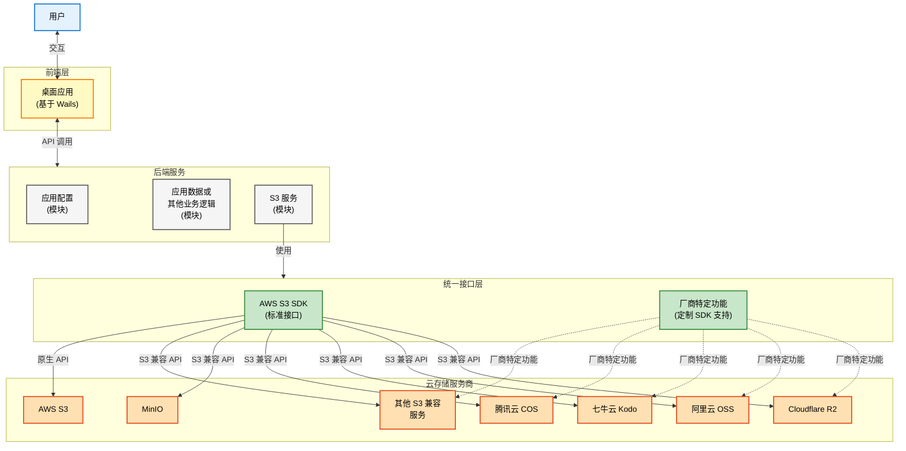

> [!WARNING]
> **项目状态**：目前处于 **MVP/Beta** 阶段，还在打磨工具的兼容性和各家厂商的适配。非常欢迎提交反馈、Bug 报送或者是 PR！

<div align="center">


# Can

**Can** 是一个用 Wails + React 编写的跨平台 S3 桌面客户端。

它旨在为你管理各家云厂商的 S3 对象存储时，提供一致且顺滑的操作体验。

[English](README.md) | 简体中文

<br />


<details>
<summary>📸 <strong>更多截图 (列表视图, 深色模式, 树状视图)</strong></summary>
<br />
<div align="center">
  
  
  
</div>
</details>

</div>


## 功能特性

- **多厂商支持**：适配 AWS S3、阿里云 OSS、腾讯云 COS、Cloudflare R2 以及其他各类 S3 兼容服务。（通过 AWS SDK + 自定义 SDK 模式）
- **现代化 UI**：界面清爽，希望像操作系统的文件管理器一样浏览和管理文件。
- **纯本地运行**：不经过任何中间服务器，所有配置和数据都存在本地的 SQLite 数据库中，你的数据由你掌控。
- **跨平台支持**：在 macOS、Windows 和 Linux 上保持一致的用户体验。
- **开箱即用**：无需复杂的环境配置，连接即可上手。

## 技术栈

- **后端**: Go + Wails
- **前端**: React + TypeScript + Vite + Tailwind CSS + shadcn/ui + TanStack
- **存储**: SQLite

## 架构



## 参与贡献

### 环境要求

- **Go**: 1.24 或更高版本。
- **Node.js**: 22 或更高版本。
- **pnpm**: 推荐使用的前端包管理工具。

更多细节请查阅 [CONTRIBUTING.md](CONTRIBUTING.md)。

### 本地开发

1.  **克隆仓库**
    ```bash
    git clone https://github.com/100gle/can.git
    cd can
    ```

2.  **执行 wails dev**
    ```bash
    wails dev
    ```
    该命令会自动处理：
    - 安装前后端依赖
    - 编译应用
    - 启动并进入热重载模式
    

3. **常用工具**
  - 运行后端测试：`go test ./...`
  - 代码质量检查：
    - Lint: `pnpm --dir frontend lint`
    - 格式化: `pnpm --dir frontend format`

## 许可证

本项目采用 Apache License 2.0 开源协议。详情请参阅 `LICENSE`。
