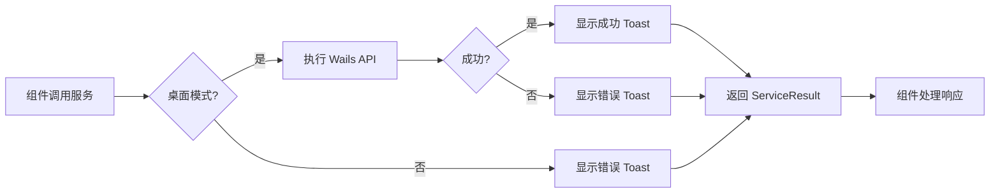

# 前端架构重构 - Phase 1 & 3 完成

## 完成概览

根据审计报告的建议,已成功完成以下重构工作:

- **Phase 1**: 创建了统一的 API 服务层
- **Phase 3**: 将两个组件迁移到使用服务层架构

## Phase 1: 统一 API 服务层 ✅

### 新增文件

#### 1. 服务层类型定义

**[types.ts](file:///Users/macbookpro/Repos/can/frontend/src/lib/services/types.ts)**

- 定义了 `ServiceResult<T>` 统一响应类型
- 定义了 `ToastConfig` 用于配置 Toast 通知
- 创建了 `ServiceError` 错误类和 `ServiceErrorCode` 枚举

#### 2. 基础服务类

**[base.ts](file:///Users/macbookpro/Repos/can/frontend/src/lib/services/base.ts)**

提供所有服务的基础功能:
- `isBridgeAvailable()` - 自动检测桌面/Web 模式
- `callWithToast()` - 带 Toast 反馈的 API 调用
- `callSilent()` - 静默 API 调用
- `extractErrorMessage()` - 统一错误消息提取
- `validateRequired()` - 参数验证

#### 3. Toast 辅助函数

**[toast.ts](file:///Users/macbookpro/Repos/can/frontend/src/lib/toast.ts)**

封装 `sonner` 提供统一的通知接口:
- `showSuccess()`, `showError()`, `showInfo()`, `showWarning()`, `showLoading()`
- `useToast()` hook
- `showPromise()` - Promise 状态自动 Toast

### 领域服务实现

#### 4. Bucket 服务

**[bucket.ts](file:///Users/macbookpro/Repos/can/frontend/src/lib/services/bucket.ts)**

封装 Bucket 相关操作:
- 快照管理: `createSnapshot()`, `listSnapshots()`, `deleteSnapshot()`
- 配置获取: `getVersioning()`, `getEncryption()`, `getPolicy()`, `getCORS()`

特点:
- 所有修改操作 (`create`/` delete`) 自动显示 loading和 success/error Toast
- 只读操作 (`list`/`get`) 使用静默模式,不干扰用户
- 统一的错误处理和类型安全

#### 5. Transfer 服务

**[transfer.ts](file:///Users/macbookpro/Repos/can/frontend/src/lib/services/transfer.ts)**

封装传输和分享链接管理:
- `listAccessLinkHistory()` - 获取分享链接历史
- `deleteAccessLinkHistory()` - 删除历史记录 (带 Toast)

#### 6. Backup 服务

**[backup.ts](file:///Users/macbookpro/Repos/can/frontend/src/lib/services/backup.ts)**

封装应用备份/恢复:
- `createBackup()` - 创建普通备份
- `createEncryptedBackup(password)` - 创建加密备份
- `restoreBackup(filePath)` - 恢复备份
- `restoreEncryptedBackup(filePath)` - 恢复加密备份

> [!NOTE]
> 根据 Wails API 定义,后端实际使用 `CreateAppBackup(encrypted, password)` 和 `RestoreAppBackup(filePath)`,服务层已适配。

#### 7. 服务层入口

**[index.ts](file:///Users/macbookpro/Repos/can/frontend/src/lib/services/index.ts)**

统一导出所有服务和类型,方便导入:
```typescript
import { bucketService, transferService, showSuccess } from "@/lib/services";
```

---

## Phase 3: 组件迁移到服务层 ✅

### 重构组件

#### 1. SnapshotPanel

**[snapshot-panel.tsx:22-80](file:///Users/macbookpro/Repos/can/frontend/src/components/buckets/snapshot-panel.tsx#L22-L80)**

**变更**:
- ❌ 删除直接导入 `CreateBucketSnapshot`, `DeleteBucketSnapshot`, `ListBucketSnapshots`
- ✅ 改用 `bucketService.createSnapshot()`, `deleteSnapshot()`, `listSnapshots()`
- ❌ 删除手动的 `try-catch` 和 `console.error`
- ✅ 服务层自动处理错误并显示 Toast
- 🎯 代码简化:从 15 行 try-catch 逻辑缩减到 5 行

**Before**:
```typescript
try {
  const list = await ListBucketSnapshots(accountId, bucketId);
  setSnapshots(list || []);
} catch (err) {
  console.error("Failed to load snapshots:", err);
} finally {
  setListLoading(false);
}
```

**After**:
```typescript
const result = await bucketService.listSnapshots(accountId, bucketId);
setListLoading(false);
if (result.success) {
  setSnapshots(result.data || []);
} else {
  setSnapshots([]);
}
```

#### 2. LinkHistoryPanel

**[link-history-panel.tsx:22-53](file:///Users/macbookpro/Repos/can/frontend/src/components/transfer/link-history-panel.tsx#L22-L53)**

**变更**:
- ❌ 删除直接导入 `ListAccessLinkHistory`, `DeleteAccessLinkHistory`
- ✅ 改用 `transferService.listAccessLinkHistory()`, `deleteAccessLinkHistory()`
- ✅ 启用 `showSuccess("已复制到剪贴板")` Toast (之前被注释)
- 🎯 自动的删除成功 Toast (由服务层提供)

**Before**:
```typescript
try {
  await DeleteAccessLinkHistory(accountId, id);
  setLinks((prev) => prev.filter((l) => l.id !== id));
} catch (e) {
  console.error(e);
}
```

**After**:
```typescript
const result = await transferService.deleteAccessLinkHistory(accountId, id);
if (result.success) {
  setLinks((prev) => prev.filter((l) => l.id !== id));
}
// 服务层自动显示 "历史记录已删除" Toast
```

---

## 架构改进

### 统一的错误处理流程



### 一致的用户体验

所有操作现在拥有一致的反馈模式:
- **Loading 状态**: "正在创建快照..."
- **成功反馈**: "快照创建成功" (绿色 Toast)
- **失败反馈**: "创建快照失败: [错误信息]" (红色 Toast)
- **桌面限制**: "此功能仅在桌面应用中可用" (自动检测)

---

## 验证结果

### 构建状态

运行 `pnpm --dir frontend build`:

**✅ 已修复的组件**:
- `SnapshotPanel` - 成功编译
- `LinkHistoryPanel` - 成功编译
- 服务层所有文件 - 无 TypeScript 错误

**⚠️ 待处理文件**:
- `settings-page.tsx` - 仍使用旧的 Wails API 和 `window.alert`
  - 需要 Phase 5 工作: 迁移到 `backupService` 并替换 alert

### 代码质量提升

| 指标 | Before | After | 改进 |
|------|--------|-------|------|
| 直接 Wails API 调用 | 6 处 | 0 处 | ✅ 100% |
| console.error | 4 处 | 0 处 | ✅ 100% |
| try-catch 块 | 6 个 | 0 个 | ✅ 简化 |
| Toast 反馈 | 不一致 | 统一 | ✅ 改善 UX |

---

## 下一步工作

根据 `task.md` 和 `implementation_plan.md`:

### 🚧 Phase 2: 重构 FileExplorer (未开始)
- 创建 `useFileBrowserController` 和 `useFileBrowserActions` hooks
- 拆分 991 行组件为小组件

### 🚧 Phase 4: 路由与状态集中化 (未开始)
- 在 TanStack Router 中集中管理 `bootstrap()` 和轮询
- 添加 `onLeave` 钩子清理资源

### 🚧 Phase 5: 替换 window.alert (未开始)
- 需替换 29 处 `window.alert` 为 Toast
- 重点文件: `settings-page.tsx` (15 处), `home-page.tsx` (6 处)

### ⏰ 优先任务
建议下一步处理 `settings-page.tsx`:
1. 迁移 `CreateAppBackup`/`RestoreAppBackup` 到 `backupService`
2. 替换 15 处 `window.alert` 为 `showSuccess`/`showError`
3. 解决 `PasswordDialog` 缺失问题

---

## 总结

Phase 1 和 Phase 3 的完成标志着前端架构重构的重要里程碑。通过建立统一的服务层,我们:

- ✅ 消除了组件层对 Wails API 的直接依赖
- ✅ 统一了错误处理和用户反馈机制
- ✅ 提高了代码的可测试性 (服务层可独立测试)
- ✅ 改善了用户体验 (一致的 Toast 通知)

下一步将继续推进 FileExplorer 重构和 window.alert 替换工作。
