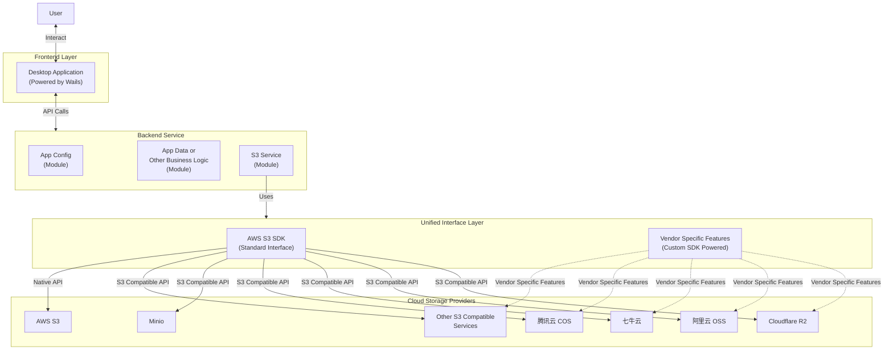

# Sprint 14: 后端架构重构 (Backend Rearchitecture)

本次 Sprint 对后端进行**简洁务实的重构**，目标是对齐 README 中的 Mermaid 架构图，同时将 `providers` 包重构为 `storage` 包，采用清晰的子包结构。

```
User → Desktop Application (Wails) → Backend Service → Unified Interface Layer → Cloud Storage Providers
```

由于当前无线上用户，**不需要兼容旧 API**。

---

## 1. 设计原则

1. **`app/` 即 Controller**：不再拆分独立的 Controller 层
2. **重命名为 `storage/` 包**：通用功能在根目录，Vendor 扩展在子包（`storage/oss/`, `storage/cos/`）
3. **双层接口设计**：S3 兼容接口 + Vendor 扩展接口
4. **参数校验使用 validator**：复杂参数使用 `go-playground/validator` 库
5. **保留 bootstrap 包**：职责清晰，不合并

---

## 2. 架构概览

基于 README 中的架构图扩展，增加接口层次说明：



**代码对应关系**：
| 架构图 | 代码实现 |
|--------|----------|
| Backend Service | `internal/app/` (Controller) + `internal/*/` (Services) |
| AWS S3 SDK (Standard Interface) | `storage.StorageClient` 接口，通过 `client.Buckets()` / `client.Objects()` 暴露驱动 |
| Vendor Specific Features | OSS/COS 子包通过 Adapter 模式继承 S3 实现并扩展 vendor-specific 方法 |

---

## 3. 接口设计

### 3.1 StorageClient 接口设计

采用 **Driver 接口模式**，而非 `Client.SDK` 嵌套结构：

- **标准操作**：通过 `client.Buckets()` 和 `client.Objects()` 获取对应 Driver
- **Vendor 扩展**：OSS/COS adapter 继承 S3 base 实现，覆写 vendor-specific 方法
- **Provider**：通过 `client.Provider()` 方法获取

```
┌─────────────────────────────────────────────────────────────┐
│                   StorageClient                              │
│  ┌───────────────────────────────────────────────────────┐  │
│  │  Provider() types.Provider                             │  │
│  │  Capabilities() []types.ProviderCapability             │  │
│  │  Buckets() BucketDriver                                │  │
│  │  Objects() ObjectDriver                                │  │
│  │  Security() SecurityDriver                             │  │
│  └───────────────────────────────────────────────────────┘  │
│                                                              │
│  ┌───────────────────────────────────────────────────────┐  │
│  │  BucketDriver (Bucket 操作)                            │  │
│  │  - ListBuckets(ctx) ([]BucketDescriptor, error)       │  │
│  │  - CreateBucket(ctx, input) error                      │  │
│  │  - GetBucketReferer(ctx, name) (BucketReferer, error) │  │
│  └───────────────────────────────────────────────────────┘  │
│  ┌───────────────────────────────────────────────────────┐  │
│  │  ObjectDriver (Object 操作)                            │  │
│  │  - ListObjects(ctx, input) (ListObjectsResult, error) │  │
│  │  - CreateSymlink(ctx, bucket, key, target) error      │  │
│  └───────────────────────────────────────────────────────┘  │
└─────────────────────────────────────────────────────────────┘
```

### 3.2 接口定义

**`internal/storage/client.go`**：

```go
package storage

import (
    "context"
    "io"

    "can/internal/types"
)

// BucketDriver exposes bucket-level operations for a provider.
type BucketDriver interface {
    ListBuckets(ctx context.Context) ([]BucketDescriptor, error)
    CreateBucket(ctx context.Context, input BucketCreateInput) error
    DeleteBucket(ctx context.Context, name string) error
    HeadBucket(ctx context.Context, name string) error
    BucketLocation(ctx context.Context, name string) (string, error)
    GetBucketACL(ctx context.Context, name string) (BucketACL, error)
    PutBucketACL(ctx context.Context, name string, acl BucketACLInput) error
    GetBucketReferer(ctx context.Context, name string) (BucketReferer, error)
    PutBucketReferer(ctx context.Context, name string, referer BucketReferer) error
    GetBucketMAZConfig(ctx context.Context, name string) (*MAZConfiguration, error)
    EnableBucketMAZ(ctx context.Context, name string) error
    DisableBucketMAZ(ctx context.Context, name string) error
    // ... 更多方法见 internal/storage/client.go
}

// ObjectDriver exposes object-level operations for a provider.
type ObjectDriver interface {
    ListObjects(ctx context.Context, input ListObjectsInput) (ListObjectsResult, error)
    UploadObject(ctx context.Context, bucket, key string, body io.Reader, size int64, contentType string) error
    DownloadObject(ctx context.Context, input DownloadObjectInput) (ObjectDownload, error)
    DeleteObject(ctx context.Context, bucket, key string) error
    CopyObject(ctx context.Context, sourceBucket, sourceKey, targetBucket, targetKey string) error
    CreateSymlink(ctx context.Context, bucket, key, target string) error  // OSS-specific
    // ... 更多方法见 internal/storage/client.go
}

// StorageClient bundles bucket/object drivers plus capability metadata.
type StorageClient interface {
    Provider() types.Provider
    Capabilities() []types.ProviderCapability
    Buckets() BucketDriver
    Objects() ObjectDriver
    Security() SecurityDriver
}

// StorageFactory resolves a storage client for the given credentials.
type StorageFactory interface {
    NewClient(ctx context.Context, creds ConnectionCredentials) (StorageClient, error)
}
```

### 3.3 Vendor Adapter 实现（子包）

OSS/COS adapter 通过组合模式继承 S3 基础实现，只覆写 vendor-specific 方法。

**`internal/storage/oss/adapter.go`**：

```go
package oss

import (
    "context"
    "can/internal/storage"
    "can/internal/storage/s3"
    "github.com/aliyun/aliyun-oss-go-sdk/oss"
)

type ossAdapter struct {
    storage.StorageClient  // 嵌入 S3 base 实现
    ossClient *oss.Client  // OSS native SDK
}

func NewStorageClient(ctx context.Context, creds storage.ConnectionCredentials) (storage.StorageClient, error) {
    base, err := s3.NewStorageClient(ctx, creds)
    if err != nil {
        return nil, err
    }
    ossClient, err := oss.New(endpoint, creds.AccessKeyID, creds.SecretAccessKey)
    if err != nil {
        return nil, err
    }
    return &ossAdapter{StorageClient: base, ossClient: ossClient}, nil
}

// 覆写 Buckets() 返回 OSS-specific bucket adapter
func (a *ossAdapter) Buckets() storage.BucketDriver {
    return &bucketAdapter{
        BucketDriver: a.StorageClient.Buckets(),
        client:       a.ossClient,
    }
}
```

**OSS-specific 功能**（如 Symlink、Referer）在 `oss/symlink.go`、`oss/referer.go` 中实现。

### 3.4 使用示例

**业务层调用**：

```go
import "can/internal/storage"

// 从 storage pool 获取 client
client, _, _ := pool.Get(ctx, accountID, supplyCredentials)

// Bucket 操作：通过 Buckets() 获取 driver
buckets, _ := client.Buckets().ListBuckets(ctx)
_ = client.Buckets().CreateBucket(ctx, input)
referer, _ := client.Buckets().GetBucketReferer(ctx, "my-bucket")

// Object 操作：通过 Objects() 获取 driver
objects, _ := client.Objects().ListObjects(ctx, input)
_ = client.Objects().CreateSymlink(ctx, bucket, linkKey, targetKey)

// 获取 Provider
provider := client.Provider()  // types.ProviderOSS, types.ProviderCOS, etc.
```

> **注意**：Vendor-specific 功能（如 OSS Symlink）直接在 `ObjectDriver` 接口，
> 调用时会根据 provider 实现返回结果或 `ErrUnsupportedCapability`。


---

## 4. 目录结构

```
internal/
├── app/                        # Controller 层
│   ├── app.go                  # Wails 入口 + 依赖组装
│   ├── accounts.go
│   ├── buckets.go
│   ├── objects.go
│   ├── transfers.go
│   ├── search.go
│   ├── system.go
│   └── validation.go
├── accounts/                   # 账户服务
├── buckets/                    # 存储桶服务
├── objects/                    # 对象服务
├── transfer/                   # 传输服务
├── config/                     # 配置服务
├── search/                     # 搜索服务
├── system/                     # 系统服务
├── storage/                    # 统一存储接口层（原 providers）
│   ├── client.go               # Bucket/Object/Security driver 接口
│   ├── factory.go              # StorageFactory + builder 选项
│   ├── pool.go                 # ClientPool
│   ├── types.go                # 通用 DTO
│   ├── types_config.go         # Bucket/Object 配置模型
│   ├── s3/                     # S3 通用实现
│   │   ├── client.go           # AWS SDK 配置 + S3Client interface
│   │   ├── drivers.go          # BucketDriver/ObjectDriver 实现
│   │   ├── dialer.go           # 凭证探测
│   │   ├── errors.go
│   │   ├── presign.go
│   │   ├── range.go
│   │   └── sts.go
│   ├── oss/                    # 阿里云 OSS 扩展
│   │   ├── adapter.go          # 组合 base StorageClient + OSS SDK
│   │   ├── referer.go
│   │   └── symlink.go
│   └── cos/                    # 腾讯云 COS 扩展
│       ├── adapter.go
│       ├── referer.go
│       └── maz.go
├── types/                      # Provider 类型与能力
│   ├── provider.go
│   └── capabilities.go
└── bootstrap/                  # 应用启动配置
    └── bootstrap.go
```

---

## 5. 驱动实现策略

### 5.1 S3 标准驱动

**一套代码，多 Vendor 复用**：

### 5.2 Vendor 扩展驱动

**仅实现该 Vendor 特有功能**：

```go
// internal/storage/oss/adapter.go（节选）

type ossAdapter struct {
    storage.StorageClient
    ossClient *oss.Client
}

func NewStorageClient(ctx context.Context, creds storage.ConnectionCredentials) (storage.StorageClient, error) {
    endpoint := resolveOSSEndpoint(creds)
    s3Creds := creds
    s3Creds.Provider = types.ProviderOSS
    s3Creds.Endpoint = endpoint

    base, err := s3.NewStorageClient(ctx, s3Creds)
    if err != nil {
        return nil, err
    }
    client, err := oss.New(endpoint, creds.AccessKeyID, creds.SecretAccessKey)
    if err != nil {
        return nil, err
    }
    return &ossAdapter{StorageClient: base, ossClient: client}, nil
}

func (a *ossAdapter) Buckets() storage.BucketDriver {
    return &bucketAdapter{
        BucketDriver: a.StorageClient.Buckets(),
        client:       a.ossClient,
    }
}

func (a *ossAdapter) Objects() storage.ObjectDriver {
    return &objectAdapter{
        ObjectDriver: a.StorageClient.Objects(),
        client:       a.ossClient,
    }
}
```

### 5.3 工厂函数

**`internal/storage/factory.go`** 通过 builder 组合 Provider：

```go
factory := storage.NewStorageFactory(
    storage.WithDefaultStorageBuilder(s3.NewStorageClient),       // MinIO/R2 等 S3 兼容 provider
    storage.WithStorageBuilder(types.ProviderOSS, oss.NewStorageClient),
    storage.WithStorageBuilder(types.ProviderCOS, cos.NewStorageClient),
)
pool := storage.NewClientPool(factory)
client, creds, err := pool.Get(ctx, accountID, supplyCredentials)
```

---

## 6. 迁移步骤

### Phase 1: 基础设施 (2 天)

- [x] 1. 引入 `go-playground/validator` 库
- [x] 2. 创建 `internal/storage/interface.go` (Integrated into `internal/storage/client.go`)
- [x] 3. 创建 `internal/storage/errors.go`
- [x] 4. 创建 `internal/app/validation.go`

### Phase 2: 重构 S3 驱动 (2 天)

- [x] 1. 将 `s3_storage_client.go` 重构为 `s3_impl.go` (Implemented as `s3/drivers.go` & `s3/client.go`)
- [x] 2. 确保实现完整的 `S3Client` 接口
- [x] 3. 分页参数使用 `Marker` / `NextMarker`（符合 S3 ListObjectsV2 习惯）

### Phase 3: 实现 Vendor 子包 (2 天)

- [x] 1. 创建 `internal/storage/oss/` 子包，实现 `oss.Adapter`
- [x] 2. 创建 `internal/storage/cos/` 子包，实现 `cos.Adapter`
- [x] 3. 实现各自的 NewAdapter 工厂函数

### Phase 4: 重构 Factory (1 天)

- [x] 1. 重构 `factory.go` (Implemented generic `NewStorageFactory`)
- [x] 2. 更新 `pool.go` 使用新的 `storage.Client` 类型

### Phase 5: App 层更新 (2 天)

- [x] 1. 为所有 API 方法添加 validator 校验
- [x] 2. 更新 Service 层引用从 `providers` 改为 `storage`
- [x] 3. ✅ ~~合并 `configfacade/` 至 `config/`~~ (已完成 - 2025-12-09)
- [x] 4. 重命名包：`providers` → `storage`

### Phase 6: 验证 (1 天)

- [x] 1. 运行 `go test ./...`
- [x] 2. 运行 `wails build`
- [x] 3. 手工测试各 Provider 功能

---

## 7. 验收标准

- [x] `S3Client` 接口覆盖所有 S3 兼容操作
- [x] OSS/COS 特有功能通过 Adapter 继承 + 覆写模式提供
- [x] 所有复杂输入参数使用 `validator` 校验
- [x] 分页 API 使用 `Marker` / `NextMarker`（S3 ContinuationToken 映射）
- [x] `go test ./...` 全部通过
- [x] `wails build` 构建成功
- [x] 各 Provider 手工测试通过

---

## 8. 扩展功能矩阵

| 扩展功能 | AWS | OSS | COS | R2 | Custom |
|---------|-----|-----|-----|-----|--------|
| Symlink | ❌ | ✅ | ❌ | ❌ | ❌ |
| Referer | ❌ | ✅ | ✅ | ❌ | ❌ |
| Public Access Block | ✅ | ❌ | ❌ | ❌ | ❌ |
| Multi-AZ | ✅ | ❌ | ✅* | ❌ | ❌ |
| Website | ✅ | ✅ | ✅ | ❌ | ❌ |
| Custom Domain | ✅ | ✅ | ✅ | ✅ | ❌ |

\* COS 仅支持在创建 Bucket 时设置 MAZ，现阶段无法在已有 Bucket 上二次切换。

---

## 9. 依赖变更

```go
// go.mod
require (
    github.com/go-playground/validator/v10 v10.x.x
    github.com/aws/aws-sdk-go-v2 v1.x.x           // S3 标准驱动
    github.com/aliyun/aliyun-oss-go-sdk v3.x.x    // OSS 扩展
    github.com/tencentyun/cos-go-sdk-v5 v0.x.x    // COS 扩展
)
```

---

## 10. 变更记录

### 2025-12-10 验证修复

**测试调整**：
- `internal/buckets/service_test.go`: `TestCreateBucketRequiresName` → `TestCreateBucketPassesToDriver`
  - 原因：按照设计原则，验证职责在 `app/` 层（Controller），Service 层不负责输入校验

**缺失 API 补充**：
- 添加 `DeleteObjectWithOptions()` 到 `app/objects.go`
- 添加 `RenameObjectWithOptions()` 到 `app/objects.go`
- 添加 `MoveObjectsWithOptions()` 到 `app/objects.go`
  - 原因：前端离线队列 (`lib/offline/manager.ts`) 需要带有 `MutationOptions` 追踪元数据的 API

### 2025-12-10 CTO 审核修复

根据 Sprint 14 审核 TODO（现已合并入本档）中的反馈，进行以下修正：

1. **storage.Client 接口对齐**：重写 Section 3，使用 `StorageClient.Buckets()`/`Objects()` Driver 接口模式替代原文档中的 `Client.SDK` 嵌套结构
2. **分页参数命名**：修正为实际使用的 `Marker`/`NextMarker`，而非 `Cursor`/`NextCursor`
3. **MutationOptions 透传**：`app/objects.go` 中 `*WithOptions` 方法现已记录 `requestId`/`origin` 用于追踪
4. **OSS Symlink**：在 Section 3.4 说明 Symlink 通过 `ObjectDriver.CreateSymlink` 调用
5. **COS MAZ 能力矩阵**：新增 `BucketDriver.GetBucketMAZConfig` 等接口，COS adapter 在创建时写入 `BucketAZConfig=MAZ` 并可回读状态，能力矩阵恢复为 ✅（仅限创建阶段）
6. **文档整体回归**：确保代码对应关系表、验收标准与实现一致

> **注意**：
> - `ListObjects` 暂未注入 `IsSymlink`/`SymlinkTarget`；读取 OSS Symlink 目标仍是 TODO（见补充文档），当前 UI 只能依赖独立 API。
> - 完整幂等去重（requestId 查重）为后续 Sprint 规划。
