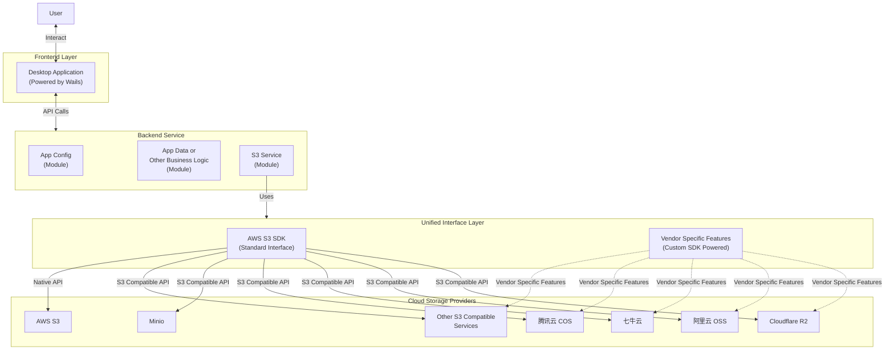

# Sprint 14: 后端架构重构 (Backend Rearchitecture)

本次 Sprint 对后端进行**简洁务实的重构**，目标是对齐 README 中的 Mermaid 架构图，同时将 `providers` 包重构为 `storage` 包，采用清晰的子包结构。

```
User → Desktop Application (Wails) → Backend Service → Unified Interface Layer → Cloud Storage Providers
```

由于当前无线上用户，**不需要兼容旧 API**。

---

## 1. 设计原则

1. **`app/` 即 Controller**：不再拆分独立的 Controller 层
2. **重命名为 `storage/` 包**：通用功能在根目录，Vendor 扩展在子包（`storage/oss/`, `storage/cos/`）
3. **双层接口设计**：S3 兼容接口 + Vendor 扩展接口
4. **参数校验使用 validator**：复杂参数使用 `go-playground/validator` 库
5. **保留 bootstrap 包**：职责清晰，不合并

---

## 2. 架构概览

基于 README 中的架构图扩展，增加接口层次说明：



**代码对应关系**：
| 架构图 | 代码实现 |
|--------|----------|
| Backend Service | `internal/app/` (Controller) + `internal/*/` (Services) |
| AWS S3 SDK (Standard Interface) | `storage.Client` 直接暴露方法，内部委托 `s3Client` |
| Vendor Specific Features | `storage.Client.SDK` 字段，实现为 `oss.Adapter` 或 `cos.Adapter` |

---

## 3. 接口设计

### 3.1 Client 结构设计

- **标准操作**：直接调用 `client.ListBuckets(ctx)`（内部委托给 `s3Client`）
- **Vendor 特有**：通过 `client.SDK.CreateSymlink(ctx, ...)` 调用
- **Provider**：通过 `client.Provider()` 方法获取

```
┌─────────────────────────────────────────────────────────────┐
│                   Client                                     │
│  ┌───────────────────────────────────────────────────────┐  │
│  │  S3 标准操作（直接暴露）                                │  │
│  │  - client.ListBuckets(ctx)                             │  │
│  │  - client.ListObjects(ctx, input)                      │  │
│  │  - client.PutObject(ctx, input)                        │  │
│  │  - client.Provider()                                    │  │
│  └───────────────────────────────────────────────────────┘  │
│  ┌───────────────────────────────────────────────────────┐  │
│  │  SDK  VendorSDK (可选，可为 nil)                        │  │
│  │  (Vendor 特有功能)                                       │  │
│  │  - client.SDK.CreateSymlink()     // OSS               │  │
│  │  - client.SDK.GetBucketReferer()  // OSS, COS          │  │
│  └───────────────────────────────────────────────────────┘  │
└─────────────────────────────────────────────────────────────┘
```

### 3.2 接口定义

**`internal/storage/interface.go`**：

```go
package storage

import (
    "context"
    "io"
)

// ============================================
// S3 兼容接口 (所有 Vendor 必须支持)
// ============================================

// S3Client 定义 S3 兼容的标准操作
type S3Client interface {
	ListBuckets(ctx context.Context, params *s3.ListBucketsInput, optFns ...func(*s3.Options)) (*s3.ListBucketsOutput, error)
	CreateBucket(ctx context.Context, params *s3.CreateBucketInput, optFns ...func(*s3.Options)) (*s3.CreateBucketOutput, error)
	DeleteBucket(ctx context.Context, params *s3.DeleteBucketInput, optFns ...func(*s3.Options)) (*s3.DeleteBucketOutput, error)
	HeadBucket(ctx context.Context, params *s3.HeadBucketInput, optFns ...func(*s3.Options)) (*s3.HeadBucketOutput, error)
	GetBucketLocation(ctx context.Context, params *s3.GetBucketLocationInput, optFns ...func(*s3.Options)) (*s3.GetBucketLocationOutput, error)
	GetBucketAcl(ctx context.Context, params *s3.GetBucketAclInput, optFns ...func(*s3.Options)) (*s3.GetBucketAclOutput, error)
	PutBucketAcl(ctx context.Context, params *s3.PutBucketAclInput, optFns ...func(*s3.Options)) (*s3.PutBucketAclOutput, error)
	// more signature methods from aws sdk s3 package.
}


// ============================================
// Vendor SDK 适配器接口
// ============================================

// VendorSDK Vendor 原生 SDK 适配器基础接口
type VendorSDK interface {
    // Name 返回供应商类型
    Name() string
}

// OSSVendorSDK 阿里云 OSS 特有功能
type OSSVendorSDK interface {
    VendorSDK
    
    // Symlink 软链接
    CreateSymlink(ctx context.Context, bucket, symlink, target string) error
    GetSymlink(ctx context.Context, bucket, symlink string) (target string, err error)
    
    // Referer 防盗链
    GetBucketReferer(ctx context.Context, bucket string) (*BucketReferer, error)
    PutBucketReferer(ctx context.Context, bucket string, referer BucketReferer) error
}

// COSVendorSDK 腾讯云 COS 特有功能
type COSVendorSDK interface {
    VendorSDK
    
    // Referer 防盗链
    GetBucketReferer(ctx context.Context, bucket string) (*BucketReferer, error)
    PutBucketReferer(ctx context.Context, bucket string, referer BucketReferer) error
    
    // MAZ 多可用区配置
    GetBucketMAZConfig(ctx context.Context, bucket string) (*MAZConfiguration, error)
}

// ============================================
// Client 聚合结构
// ============================================

// Client 统一的存储客户端
type Client struct {
    s3       *S3Client  // 私有，S3 兼容操作
    SDK      VendorSDK  // 公开，Vendor 特有操作（可为 nil）
}

// Provider 返回供应商类型
func (c *Client) Provider() string {
    if c.SDK != nil {
        return c.SDK.Name()
    }
    return "Unknown"
}

// ============================================
// S3 标准操作直接暴露（委托给 s3Client）
// ============================================

func (c *Client) ListBuckets(ctx context.Context, params *s3.ListBucketsInput, optFns ...func(*s3.Options)) ([]BucketDescriptor, error) {
    return c.s3.ListBuckets(ctx, params, optFns...)
}

func (c *Client) ListObjects(ctx context.Context, params *s3.ListObjectsInput, optFns ...func(*s3.Options)) (*ListObjectsResult, error) {
    // 可在此处添加额外逻辑、适配不同 Provider 差异
    return c.s3.ListObjects(ctx, params, optFns...)
}

func (c *Client) PutObject(ctx context.Context, params *s3.PutObjectInput, optFns ...func(*s3.Options)) error {
    return c.s3.PutObject(ctx, params, optFns...)
}

func (c *Client) GetObject(ctx context.Context, params *s3.GetObjectInput, optFns ...func(*s3.Options)) (*ObjectDownload, error) {
    return c.s3.GetObject(ctx, params, optFns...)
}

// ... 其他 S3 标准操作同理委托
```

### 3.3 Vendor SDK 实现（子包）

**`internal/storage/oss/adapter.go`**：

```go
package oss

import (
    "context"
    "can/internal/storage"
    ossSDK "github.com/aliyun/aliyun-oss-go-sdk/oss"
)

// Adapter 阿里云 OSS SDK 适配器
type Adapter struct {
    client *ossSDK.Client
}

func (a *Adapter) Name() string {
    return "oss"
}

func (a *Adapter) CreateSymlink(ctx context.Context, bucket, symlink, target string) error {
    b, err := a.client.Bucket(bucket)
    if err != nil {
        return err
    }
    return b.PutSymlink(symlink, target)
}

func (a *Adapter) GetSymlink(ctx context.Context, bucket, symlink string) (string, error) {
    b, err := a.client.Bucket(bucket)
    if err != nil {
        return "", err
    }
    return b.GetSymlink(symlink)
}

func (a *Adapter) GetBucketReferer(ctx context.Context, bucket string) (*storage.BucketReferer, error) {
    result, err := a.client.GetBucketReferer(bucket)
    if err != nil {
        return nil, err
    }
    return convertOSSReferer(result), nil
}

func (a *Adapter) PutBucketReferer(ctx context.Context, bucket string, referer storage.BucketReferer) error {
    return a.client.SetBucketReferer(bucket, referer.AllowList, referer.AllowEmpty)
}

func NewAdapter(account storage.Account) (*Adapter, error) {
    client, err := ossSDK.New(account.Endpoint, account.AccessKey, account.SecretKey)
    if err != nil {
        return nil, err
    }
    return &Adapter{client: client}, nil
}
```

**`internal/storage/cos/adapter.go`**：

```go
package cos

import (
    "context"
    "can/internal/storage"
    cosSDK "github.com/tencentyun/cos-go-sdk-v5"
)

// Adapter 腾讯云 COS SDK 适配器
type Adapter struct {
    client *cosSDK.Client
}

func (a *Adapter) Name() string {
    return "cos"
}

func (a *Adapter) GetBucketReferer(ctx context.Context, bucket string) (*storage.BucketReferer, error) {
    result, err := a.client.Bucket.GetReferer(ctx)
    if err != nil {
        return nil, err
    }
    return convertCOSReferer(result), nil
}

func (a *Adapter) PutBucketReferer(ctx context.Context, bucket string, referer storage.BucketReferer) error {
    return a.client.Bucket.PutReferer(ctx, convertToCOSReferer(referer))
}

func (a *Adapter) GetBucketMAZConfig(ctx context.Context, bucket string) (*storage.MAZConfiguration, error) {
    // COS 特有的多可用区配置
    // ...
}

func NewAdapter(account storage.Account) (*Adapter, error) {
    // 初始化 COS SDK
    // ...
}
```

### 3.4 使用示例

**业务层调用（对外 API）**：

```go
import "can/internal/storage"

// 创建 Client
client, _ := storage.NewClient(account)

// S3 标准操作：直接调用
buckets, _ := client.ListBuckets(ctx)
objects, _ := client.ListObjects(ctx, input)
_ = client.PutObject(ctx, input)

// 获取 Provider
provider := client.Provider()  // "oss", "cos", "aws", etc.
```

**Vendor 扩展调用（类型断言）**：

```go
import (
    "can/internal/storage"
    "can/internal/storage/oss"
    "can/internal/storage/cos"
)

// 检查并使用 OSS 扩展
if client.SDK != nil {
    if ossSDK, ok := client.SDK.(*oss.Adapter); ok {
        // OSS 特有功能
        _ = ossSDK.CreateSymlink(ctx, bucket, symlink, target)
        referer, _ := ossSDK.GetBucketReferer(ctx, bucket)
    }
    
    if cosSDK, ok := client.SDK.(*cos.Adapter); ok {
        // COS 特有功能
        referer, _ := cosSDK.GetBucketReferer(ctx, bucket)
        maz, _ := cosSDK.GetBucketMAZConfig(ctx, bucket)
    }
}
```

---

## 4. 目录结构

```
internal/
├── app/                        # Controller 层
│   ├── app.go                  # Wails 入口 + 依赖组装
│   ├── accounts.go
│   ├── buckets.go
│   ├── objects.go
│   ├── transfers.go
│   ├── config.go
│   ├── search.go
│   ├── system.go
│   └── validation.go           # 【新增】统一参数校验
│
├── accounts/                   # 账户服务
├── buckets/                    # 存储桶服务
├── objects/                    # 对象服务
├── transfer/                   # 传输服务
├── config/                     # 配置服务
├── search/                     # 搜索服务
├── security/                   # 安全审计
├── backup/                     # 备份服务
├── system/                     # 系统服务
│
├── storage/                    # 统一存储接口层（原 providers）
│   ├─── 核心接口和类型 ─────
│   ├── interface.go            # S3Client、VendorSDK 接口定义
│   ├── types.go                # 通用类型（Input/Output）
│   ├── errors.go               # 统一错误类型
│   │
│   ├─── S3 标准实现 ─────
│   ├── client.go               # Client 聚合结构
│   ├── s3_client.go            # S3 客户端初始化
│   ├── s3_impl.go              # S3Client 接口实现
│   ├── s3_multipart.go         # 分片上传
│   ├── s3_errors.go            # S3 错误处理
│   ├── s3_dialer.go            # S3 连接配置
│   │
│   ├─── 工厂和池 ─────
│   ├── factory.go              # NewClient 工厂函数
│   ├── pool.go                 # 客户端池管理
│   │
│   ├─── 辅助工具 ─────
│   ├── presign_helpers.go
│   ├── range.go
│   ├── sts_driver.go
│   │
│   ├─── Vendor 子包 ─────
│   ├── oss/                    # 阿里云 OSS 扩展
│   │   ├── adapter.go          # OSS Adapter 实现
│   │   ├── symlink.go          # Symlink 功能
│   │   ├── referer.go          # 防盗链
│   │   └── types.go            # OSS 特有类型
│   │
│   └── cos/                    # 腾讯云 COS 扩展
│       ├── adapter.go          # COS Adapter 实现
│       ├── referer.go          # 防盗链
│       ├── maz.go              # 多可用区
│       └── types.go            # COS 特有类型
│
├── types/                      # Provider 类型与能力
│   ├── provider.go
│   └── capabilities.go
│
└── bootstrap/                  # 应用启动配置
    └── bootstrap.go
```

---

## 5. 驱动实现策略

### 5.1 S3 标准驱动

**一套代码，多 Vendor 复用**：

### 5.2 Vendor 扩展驱动

**仅实现该 Vendor 特有功能**：

```go
// internal/storage/oss/adapter.go

package oss

import (
    "context"
    "can/internal/storage"
    ossSDK "github.com/aliyun/aliyun-oss-go-sdk/oss"
)

type Adapter struct {
    client *ossSDK.Client  // 阿里云 OSS SDK
}

func (a *Adapter) CreateSymlink(ctx context.Context, bucket, symlink, target string) error {
    b, err := a.client.Bucket(bucket)
    if err != nil {
        return err
    }
    return b.PutSymlink(symlink, target)
}

func (a *Adapter) GetBucketReferer(ctx context.Context, bucket string) (*storage.BucketReferer, error) {
    b, err := a.client.Bucket(bucket)
    if err != nil {
        return nil, err
    }
    result, err := b.GetBucketReferer()
    if err != nil {
        return nil, err
    }
    return convertOSSReferer(result), nil
}
```

### 5.3 工厂函数

**`internal/storage/factory.go`**：

```go
package storage

import (
    "can/internal/storage/oss"
    "can/internal/storage/cos"
)

// NewClient 创建存储客户端
func NewClient(account Account) (*Client, error) {
    // 1. 创建 S3 基础客户端 (所有 Vendor 都用)
    s3Sdk, err := newS3SDK(account)
    if err != nil {
        return nil, err
    }
    s3Client := &s3ClientImpl{client: s3Sdk}
    
    // 2. 根据 Provider 创建 SDK 适配器（子包）
    var sdk VendorSDK
    switch account.Provider {
    case "oss":
        adapter, err := oss.NewAdapter(account)
        if err == nil {
            sdk = adapter
        }
    case "cos":
        adapter, err := cos.NewAdapter(account)
        if err == nil {
            sdk = adapter
        }
    // AWS, R2, Minio, Custom 等没有 vendor SDK，SDK 为 nil
    }
    
    return &Client{
        s3:       s3Client,
        SDK:      sdk,
    }, nil
}
```

---

## 6. 迁移步骤

### Phase 1: 基础设施 (2 天)

1. 引入 `go-playground/validator` 库
2. 创建 `internal/storage/interface.go`
3. 创建 `internal/storage/errors.go`
4. 创建 `internal/app/validation.go`

### Phase 2: 重构 S3 驱动 (2 天)

1. 将 `s3_storage_client.go` 重构为 `s3_impl.go`
2. 确保实现完整的 `S3Client` 接口
3. 统一分页参数为 `Cursor` / `NextCursor`

### Phase 3: 实现 Vendor 子包 (2 天)

1. 创建 `internal/storage/oss/` 子包，实现 `oss.Adapter`
2. 创建 `internal/storage/cos/` 子包，实现 `cos.Adapter`
3. 实现各自的 NewAdapter 工厂函数

### Phase 4: 重构 Factory (1 天)

1. 重构 `factory.go`，集成 `oss.NewAdapter()` 和 `cos.NewAdapter()`
2. 更新 `pool.go` 使用新的 `storage.Client` 类型

### Phase 5: App 层更新 (2 天)

1. 为所有 API 方法添加 validator 校验
2. 更新 Service 层引用从 `providers` 改为 `storage`
3. ✅ ~~合并 `configfacade/` 至 `config/`~~ (已完成 - 2025-12-09)
4. 重命名包：`providers` → `storage`

### Phase 6: 验证 (1 天)

1. 运行 `go test ./...`
2. 运行 `wails build`
3. 手工测试各 Provider 功能

---

## 7. 验收标准

- [ ] `S3Client` 接口覆盖所有 S3 兼容操作
- [ ] OSS/COS 特有功能通过 `Client.SDK` 提供（检查 `SDK != nil`）
- [ ] 所有复杂输入参数使用 `validator` 校验
- [ ] 分页 API 统一使用 `Cursor` / `NextCursor`
- [ ] `go test ./...` 全部通过
- [ ] `wails build` 构建成功
- [ ] 各 Provider 手工测试通过

---

## 8. 扩展功能矩阵

| 扩展功能 | AWS | OSS | COS | R2 | Custom |
|---------|-----|-----|-----|-----|--------|
| Symlink | ❌ | ✅ | ❌ | ❌ | ❌ |
| Referer | ❌ | ✅ | ✅ | ❌ | ❌ |
| Public Access Block | ✅ | ❌ | ❌ | ❌ | ❌ |
| Multi-AZ | ✅ | ❌ | ✅ | ❌ | ❌ |
| Website | ✅ | ✅ | ✅ | ❌ | ❌ |
| Custom Domain | ✅ | ✅ | ✅ | ✅ | ❌ |

---

## 9. 依赖变更

```go
// go.mod
require (
    github.com/go-playground/validator/v10 v10.x.x
    github.com/aws/aws-sdk-go-v2 v1.x.x           // S3 标准驱动
    github.com/aliyun/aliyun-oss-go-sdk v3.x.x    // OSS 扩展
    github.com/tencentyun/cos-go-sdk-v5 v0.x.x    // COS 扩展
)
```
