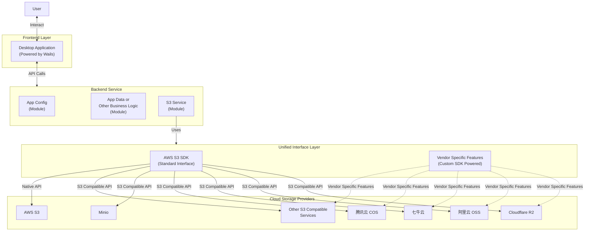

# Sprint 14: 后端架构重构 (Backend Rearchitecture)

本次 Sprint 对后端进行**简洁务实的重构**，目标是对齐 README 中的 Mermaid 架构图，同时避免过度设计。

```
User → Desktop Application (Wails) → Backend Service → Unified Interface Layer → Cloud Storage Providers
```

由于当前无线上用户，**不需要兼容旧 API**。

---

## 1. 设计原则

1. **`app/` 即 Controller**：不再拆分独立的 Controller 层
2. **保留 `providers/` 包名**：平铺命名（`s3_*.go`、`oss_*.go`）
3. **双层接口设计**：S3 兼容接口 + Vendor 扩展接口
4. **参数校验使用 validator**：复杂参数使用 `go-playground/validator` 库
5. **保留 bootstrap 包**：职责清晰，不合并

---

## 2. 架构概览

基于 README 中的架构图扩展，增加接口层次说明：



**代码对应关系**：
| 架构图 | 代码实现 |
|--------|----------|
| Backend Service | `internal/app/` (Controller) + `internal/*/` (Services) |
| AWS S3 SDK (Standard Interface) | `Client` 直接暴露方法，内部委托 `s3Client` |
| Vendor Specific Features | `Client.SDK` 字段，类型断言后调用 |

---

## 3. 接口设计

### 3.1 Client 结构设计

- **标准操作**：直接调用 `client.ListBuckets(ctx)`（内部委托给 `s3Client`）
- **Vendor 特有**：通过 `client.SDK.CreateSymlink(ctx, ...)` 调用
- **Provider**：通过 `client.Provider()` 方法获取

```
┌─────────────────────────────────────────────────────────────┐
│                   Client                                     │
│  ┌───────────────────────────────────────────────────────┐  │
│  │  S3 标准操作（直接暴露）                                │  │
│  │  - client.ListBuckets(ctx)                             │  │
│  │  - client.ListObjects(ctx, input)                      │  │
│  │  - client.PutObject(ctx, input)                        │  │
│  │  - client.Provider()                                    │  │
│  └───────────────────────────────────────────────────────┘  │
│  ┌───────────────────────────────────────────────────────┐  │
│  │  SDK  VendorSDK (可选，可为 nil)                        │  │
│  │  (Vendor 特有功能)                                       │  │
│  │  - client.SDK.CreateSymlink()     // OSS               │  │
│  │  - client.SDK.GetBucketReferer()  // OSS, COS          │  │
│  └───────────────────────────────────────────────────────┘  │
└─────────────────────────────────────────────────────────────┘
```

### 3.2 接口定义

**`internal/providers/interface.go`**：

```go
package providers

import (
    "context"
    "io"
)

// ============================================
// S3 兼容接口 (所有 Vendor 必须支持)
// ============================================

// S3Client 定义 S3 兼容的标准操作
type S3Client interface {
    // Bucket 操作
    ListBuckets(ctx context.Context) ([]BucketDescriptor, error)
    CreateBucket(ctx context.Context, input BucketCreateInput) error
    DeleteBucket(ctx context.Context, name string) error
    HeadBucket(ctx context.Context, name string) error
    BucketLocation(ctx context.Context, name string) (string, error)
    
    // Object 基础操作
    ListObjects(ctx context.Context, input ListObjectsInput) (*ListObjectsResult, error)
    GetObject(ctx context.Context, input DownloadObjectInput) (*ObjectDownload, error)
    PutObject(ctx context.Context, input PutObjectInput) error
    DeleteObject(ctx context.Context, bucket, key string) error
    DeleteObjects(ctx context.Context, bucket string, keys []string) (*BatchDeleteResult, error)
    CopyObject(ctx context.Context, input CopyObjectInput) error
    HeadObject(ctx context.Context, bucket, key string) (*ObjectDescriptor, error)
    
    // 预签名 URL
    GeneratePresignedGetURL(ctx context.Context, bucket, key string, expires int) (string, error)
    GeneratePresignedPutURL(ctx context.Context, bucket, key, contentType string, expires int) (string, error)
    
    // 分片上传
    CreateMultipartUpload(ctx context.Context, bucket, key, contentType string) (uploadID string, err error)
    UploadPart(ctx context.Context, input UploadPartInput) (*PartInfo, error)
    CompleteMultipartUpload(ctx context.Context, bucket, key, uploadID string, parts []PartInfo) error
    AbortMultipartUpload(ctx context.Context, bucket, key, uploadID string) error
    ListParts(ctx context.Context, bucket, key, uploadID string) ([]PartInfo, error)
    
    // Bucket 配置 (S3 标准)
    GetBucketACL(ctx context.Context, bucket string) (*BucketACL, error)
    PutBucketACL(ctx context.Context, bucket string, acl BucketACLInput) error
    GetBucketCORS(ctx context.Context, bucket string) (*CORSConfiguration, error)
    PutBucketCORS(ctx context.Context, bucket string, cors CORSConfiguration) error
    DeleteBucketCORS(ctx context.Context, bucket string) error
    GetBucketVersioning(ctx context.Context, bucket string) (*VersioningConfiguration, error)
    PutBucketVersioning(ctx context.Context, bucket string, status string) error
    GetBucketEncryption(ctx context.Context, bucket string) (*EncryptionConfiguration, error)
    PutBucketEncryption(ctx context.Context, bucket string, enc EncryptionConfiguration) error
    GetBucketLifecycle(ctx context.Context, bucket string) (*LifecycleConfiguration, error)
    PutBucketLifecycle(ctx context.Context, bucket string, lc LifecycleConfiguration) error
    GetBucketPolicy(ctx context.Context, bucket string) (string, error)
    PutBucketPolicy(ctx context.Context, bucket string, policy string) error
    
    // 元信息
    Provider() string
}

// ============================================
// Vendor SDK 适配器接口
// ============================================

// VendorSDK Vendor 原生 SDK 适配器基础接口
type VendorSDK interface {
    // Provider 返回供应商类型
    Provider() string
}

// OSSVendorSDK 阿里云 OSS 特有功能
type OSSVendorSDK interface {
    VendorSDK
    
    // Symlink 软链接
    CreateSymlink(ctx context.Context, bucket, symlink, target string) error
    GetSymlink(ctx context.Context, bucket, symlink string) (target string, err error)
    
    // Referer 防盗链
    GetBucketReferer(ctx context.Context, bucket string) (*BucketReferer, error)
    PutBucketReferer(ctx context.Context, bucket string, referer BucketReferer) error
}

// COSVendorSDK 腾讯云 COS 特有功能
type COSVendorSDK interface {
    VendorSDK
    
    // Referer 防盗链
    GetBucketReferer(ctx context.Context, bucket string) (*BucketReferer, error)
    PutBucketReferer(ctx context.Context, bucket string, referer BucketReferer) error
    
    // MAZ 多可用区配置
    GetBucketMAZConfig(ctx context.Context, bucket string) (*MAZConfiguration, error)
}

// ============================================
// Client 聚合结构
// ============================================

// Client 统一的存储客户端
type Client struct {
    s3       *s3Client  // 私有，S3 兼容操作
    SDK      VendorSDK  // 公开，Vendor 特有操作（可为 nil）
    provider string     // 私有，供应商类型
}

// Provider 返回供应商类型
func (c *Client) Provider() string {
    return c.provider
}

// ============================================
// S3 标准操作直接暴露（委托给 s3Client）
// ============================================

func (c *Client) ListBuckets(ctx context.Context) ([]BucketDescriptor, error) {
    return c.s3.ListBuckets(ctx)
}

func (c *Client) ListObjects(ctx context.Context, input ListObjectsInput) (*ListObjectsResult, error) {
    // 可在此处添加额外逻辑、适配不同 Provider 差异
    return c.s3.ListObjects(ctx, input)
}

func (c *Client) PutObject(ctx context.Context, input PutObjectInput) error {
    return c.s3.PutObject(ctx, input)
}

func (c *Client) GetObject(ctx context.Context, input DownloadObjectInput) (*ObjectDownload, error) {
    return c.s3.GetObject(ctx, input)
}

// ... 其他 S3 标准操作同理委托
```

### 3.3 Vendor SDK 实现

```go
// oss_sdk.go

// ossSDKAdapter 阿里云 OSS SDK 适配器
type ossSDKAdapter struct {
    client *oss.Client
}

func (a *ossSDKAdapter) Provider() string {
    return "oss"
}

func (a *ossSDKAdapter) CreateSymlink(ctx context.Context, bucket, symlink, target string) error {
    b, err := a.client.Bucket(bucket)
    if err != nil {
        return err
    }
    return b.PutSymlink(symlink, target)
}

func (a *ossSDKAdapter) GetSymlink(ctx context.Context, bucket, symlink string) (string, error) {
    b, err := a.client.Bucket(bucket)
    if err != nil {
        return "", err
    }
    return b.GetSymlink(symlink)
}

func (a *ossSDKAdapter) GetBucketReferer(ctx context.Context, bucket string) (*BucketReferer, error) {
    result, err := a.client.GetBucketReferer(bucket)
    if err != nil {
        return nil, err
    }
    return convertOSSReferer(result), nil
}

func (a *ossSDKAdapter) PutBucketReferer(ctx context.Context, bucket string, referer BucketReferer) error {
    return a.client.SetBucketReferer(bucket, referer.AllowList, referer.AllowEmpty)
}
```

```go
// cos_sdk.go

// cosSDKAdapter 腾讯云 COS SDK 适配器
type cosSDKAdapter struct {
    client *cos.Client
}

func (a *cosSDKAdapter) Provider() string {
    return "cos"
}

func (a *cosSDKAdapter) GetBucketReferer(ctx context.Context, bucket string) (*BucketReferer, error) {
    result, err := a.client.Bucket.GetReferer(ctx)
    if err != nil {
        return nil, err
    }
    return convertCOSReferer(result), nil
}

func (a *cosSDKAdapter) PutBucketReferer(ctx context.Context, bucket string, referer BucketReferer) error {
    return a.client.Bucket.PutReferer(ctx, convertToCOSReferer(referer))
}

func (a *cosSDKAdapter) GetBucketMAZConfig(ctx context.Context, bucket string) (*MAZConfiguration, error) {
    // COS 特有的多可用区配置
    // ...
}
```

### 3.4 使用示例

```go
// 创建 Client
client, _ := providers.NewClient(account)

// S3 标准操作：直接调用
buckets, _ := client.ListBuckets(ctx)
objects, _ := client.ListObjects(ctx, input)
_ = client.PutObject(ctx, input)

// 获取 Provider
provider := client.Provider()  // "oss", "cos", "aws", etc.

// Vendor 特有操作：先检查 SDK != nil，再类型断言
if client.SDK != nil {
    switch sdk := client.SDK.(type) {
    case providers.OSSVendorSDK:
        // OSS 特有功能
        _ = sdk.CreateSymlink(ctx, bucket, symlink, target)
        referer, _ := sdk.GetBucketReferer(ctx, bucket)
        
    case providers.COSVendorSDK:
        // COS 特有功能
        referer, _ := sdk.GetBucketReferer(ctx, bucket)
        maz, _ := sdk.GetBucketMAZConfig(ctx, bucket)
    }
}

// 或者直接类型断言
if ossSDK, ok := client.SDK.(providers.OSSVendorSDK); ok {
    _ = ossSDK.CreateSymlink(ctx, bucket, symlink, target)
}
```

---

## 4. 目录结构

```
internal/
├── app/                        # Controller 层
│   ├── app.go                  # Wails 入口 + 依赖组装
│   ├── accounts.go
│   ├── buckets.go
│   ├── objects.go
│   ├── transfers.go
│   ├── config.go
│   ├── search.go
│   ├── system.go
│   └── validation.go           # 【新增】统一参数校验
│
├── accounts/                   # 账户服务
├── buckets/                    # 存储桶服务
├── objects/                    # 对象服务
├── transfer/                   # 传输服务
├── config/                     # 配置服务
├── search/                     # 搜索服务
├── security/                   # 安全审计
├── backup/                     # 备份服务
├── system/                     # 系统服务
│
├── providers/                  # Unified Interface Layer
│   ├── interface.go            # 【新增】统一接口定义
│   ├── errors.go               # 【新增】统一错误类型
│   ├── types.go                # 输入输出结构体（从 storage.go 提取）
│   ├── factory.go              # 驱动工厂（重构 storage_factory.go）
│   ├── pool.go                 # 客户端缓存（重命名 client_pool.go）
│   │
│   │  # S3 兼容驱动 (使用 AWS SDK，覆盖所有 Vendor)
│   ├── s3_client.go            # S3 客户端初始化
│   ├── s3_client_impl.go       # S3Client 接口实现
│   ├── s3_multipart.go         # 分片上传实现
│   │
│   │  # Vendor 扩展驱动 (使用各厂商 SDK)
│   ├── oss_extension.go        # OSS 扩展功能 (Symlink, Referer)
│   └── cos_extension.go        # COS 扩展功能 (MAZ, Referer)
│
├── types/                      # Provider 类型与能力
│   ├── provider.go
│   └── capabilities.go
│
├── configfacade/               # 【合并至 config/】
└── bootstrap/                  # 应用启动配置
    └── bootstrap.go
```

---

## 5. 驱动实现策略

### 5.1 S3 标准驱动

**一套代码，多 Vendor 复用**：

```go
// s3_client.go

// s3Client 是纯粹的 S3 兼容操作方法集合
type s3Client struct {
    client *s3.Client  // AWS S3 SDK 客户端
}

// 所有 S3 兼容 Vendor 共用此实现
func (c *s3Client) ListObjects(ctx context.Context, input ListObjectsInput) (*ListObjectsResult, error) {
    output, err := c.client.ListObjectsV2(ctx, &s3.ListObjectsV2Input{
        Bucket:            aws.String(input.Bucket),
        Prefix:            aws.String(input.Prefix),
        Delimiter:         aws.String(input.Delimiter),
        MaxKeys:           aws.Int32(int32(input.Limit)),
        ContinuationToken: nilIfEmpty(input.Cursor),
    })
    if err != nil {
        return nil, wrapS3Error(err)
    }
    return convertListResult(output), nil
}
```

### 5.2 Vendor 扩展驱动

**仅实现该 Vendor 特有功能**：

```go
// oss_extension.go
type OSSExtension struct {
    ossClient *oss.Client  // 阿里云 OSS SDK
}

func (e *OSSExtension) CreateSymlink(ctx context.Context, bucket, symlink, target string) error {
    b, err := e.ossClient.Bucket(bucket)
    if err != nil {
        return err
    }
    return b.PutSymlink(symlink, target)
}

func (e *OSSExtension) GetBucketReferer(ctx context.Context, bucket string) (*BucketReferer, error) {
    b, err := e.ossClient.Bucket(bucket)
    if err != nil {
        return nil, err
    }
    result, err := b.GetBucketReferer()
    if err != nil {
        return nil, err
    }
    return convertOSSReferer(result), nil
}
```

### 5.3 工厂函数

```go
// factory.go

// NewClient 创建存储客户端
func NewClient(account Account) (*Client, error) {
    // 1. 创建 S3 基础客户端 (所有 Vendor 都用)
    s3Sdk, err := newS3SDK(account)
    if err != nil {
        return nil, err
    }
    s3 := &s3Client{client: s3Sdk, provider: account.Provider}
    
    // 2. 根据 Provider 创建 SDK 适配器
    var sdk VendorSDK
    switch account.Provider {
    case "oss":
        ossClient, err := newOSSSDK(account)
        if err == nil {
            sdk = &ossSDKAdapter{client: ossClient}
        }
    case "cos":
        cosClient, err := newCOSSDK(account)
        if err == nil {
            sdk = &cosSDKAdapter{client: cosClient}
        }
    // AWS, R2, Minio, Custom 等没有 vendor SDK，SDK 为 nil
    }
    
    return &Client{
        s3:       s3,
        SDK:      sdk,
        provider: account.Provider,
    }, nil
}
```

---

## 6. 迁移步骤

### Phase 1: 基础设施 (2 天)

1. 引入 `go-playground/validator` 库
2. 创建 `internal/providers/interface.go`
3. 创建 `internal/providers/errors.go`
4. 创建 `internal/app/validation.go`

### Phase 2: 重构 S3 驱动 (2 天)

1. 将 `s3_storage_client.go` 重构为 `s3_standard.go`
2. 确保实现完整的 `S3Client` 接口
3. 统一分页参数为 `Cursor` / `NextCursor`

### Phase 3: 实现扩展驱动 (2 天)

1. 创建 `oss_extension.go` 实现 OSS 特有功能
2. 创建 `cos_extension.go` 实现 COS 特有功能

### Phase 4: 重构 Factory (1 天)

1. 重构 `factory.go` 创建 `CompositeStorageClient`
2. 更新 `pool.go` 使用新的客户端类型

### Phase 5: App 层更新 (2 天)

1. 为所有 API 方法添加 validator 校验
2. 更新 Service 层使用新的接口
3. 合并 `configfacade/` 至 `config/`

### Phase 6: 验证 (1 天)

1. 运行 `go test ./...`
2. 运行 `wails build`
3. 手工测试各 Provider 功能

---

## 7. 验收标准

- [ ] `S3Client` 接口覆盖所有 S3 兼容操作
- [ ] OSS/COS 特有功能通过 `Client.SDK` 提供（检查 `SDK != nil`）
- [ ] 所有复杂输入参数使用 `validator` 校验
- [ ] 分页 API 统一使用 `Cursor` / `NextCursor`
- [ ] `go test ./...` 全部通过
- [ ] `wails build` 构建成功
- [ ] 各 Provider 手工测试通过

---

## 8. 扩展功能矩阵

| 扩展功能 | AWS | OSS | COS | R2 | Custom |
|---------|-----|-----|-----|-----|--------|
| Symlink | ❌ | ✅ | ❌ | ❌ | ❌ |
| Referer | ❌ | ✅ | ✅ | ❌ | ❌ |
| Public Access Block | ✅ | ❌ | ❌ | ❌ | ❌ |
| Multi-AZ | ✅ | ❌ | ✅ | ❌ | ❌ |
| Website | ✅ | ✅ | ✅ | ❌ | ❌ |
| Custom Domain | ✅ | ✅ | ✅ | ✅ | ❌ |

---

## 9. 依赖变更

```go
// go.mod
require (
    github.com/go-playground/validator/v10 v10.x.x
    github.com/aws/aws-sdk-go-v2 v1.x.x           // S3 标准驱动
    github.com/aliyun/aliyun-oss-go-sdk v3.x.x    // OSS 扩展
    github.com/tencentyun/cos-go-sdk-v5 v0.x.x    // COS 扩展
)
```
